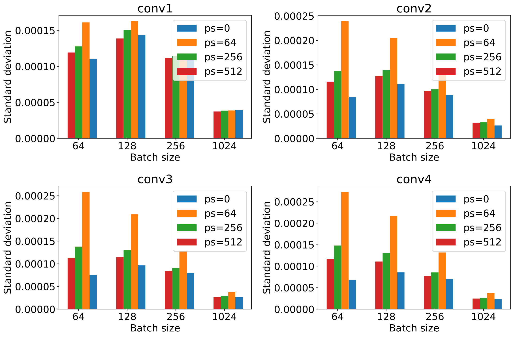

# refs


@NEURIPS2019_9015 : pytorch
@Flux
@lightonproj

Trace estimation as part of gaussian process:
- @GPyTorch

gradient approx in ML and other:

- @DFA1
- @oktay2020randomized : princeton RAD
- @frenkel : DRTP, Error-Sign-Based DFA
- @wangacccnn : randomized cnn gradient (zero dw, randn dw, top-k dy)
- @nokland19a : TRaining with errors


LR:
- @TroppLR : streaminf algo for LR marices

Large batch size:

- @DBLP : large mini batch facebok (batch  Xk, lr Xk)
- @LARS : large batch size ref paper and algo
- @Pinckaers : streamed tile based conv for large images (8k)

probing:

- @Kaperick2019DiagonalEW : master thesis
- @cortinovis2020randomized : trace estimate for indefinite matrix
- @hutchpp, @Avron

@2014cudnn

# TODO

- [] Add refs
- [] redo math
- [] Run gpu benchmark (maybe)
- [] Cleanup theory
- [] Redo some plots

## Abstract

bonjour

## Introduction

- Convolution layer gradients are expensive and main cost of CNNs.
- Unbiased approximation shown to be good (RAD) and randomness as well (DFA)
- Low memory = larger batch size. Large batch size trending (LARS, facebook large minibatch)
(- Lessons learned from PDE adjoint state)
- Extremely easy swap in, swap out implementation compatible with any pytorch network.

## Related work

RAD
Compress sensing
DFA
Randomized SVD
Gaussian inference

## Theory

Consider the standard convolution on an input ``\mathbf{X}`` with weights ``w_i``. We can write the convolution in a linear algebra form as follows:

```math {#LAconv}
\mathbf{W} &= \sum_{i=1}^{n_w} w_i T_{k(i)} \\
\mathbf{Y} &= \mathbf{W}\mathbf{X}
```

In this formulation, ``\mathbf{T}_{k(i)}`` is the circular shift operator that shifts a vector by ``k(i)``, ``k(i)`` is the shift corresponding to the ``i^{th}`` weight in ``\mathbf{w}`` and ``\overrightarrow{\operatorname{diag}}`` is the operator that puts a vector onto the diagonal (no seond argument) or onto the ``k(i)^{th}`` off-digonal (with second argument). While this formulation doesn't represent the computational aspect of the convolution, we can easily derive the gradient with respect to the weight for the convolution in a linear algebra framework. Apllying the chain rule to Equation #LAconv we can write:

```math {#dwtr}
\frac{\partial }{\partial w_i} f(\mathbf{W}\mathbf{X}) &= \operatorname{tr}\left(\left(\frac{\partial f(\mathbf{W}\mathbf{X})}{\partial \mathbf{W}}\right)^\top \frac{\partial \mathbf{W}}{\partial w_i}\right) \\
                                                       &= \operatorname{tr}\left(\left(\delta \mathbf{Y} \mathbf{X}^\top\right)^\top \mathbf{T}_{k(i)}^\top\right) \\
                                                       &= \operatorname{tr}\left(\mathbf{X} \delta \mathbf{Y}^\top \mathbf{T}_{-k(i)}\right), i=1\cdots n_w.
```

where ``\mathbf{X}, \delta \mathbf{Y}`` are ``\mathbf{x}, \delta \mathbf{y}`` vectorized along the image and channel dimensions. Similarly to the forward convolution ``overleftarrow{\operatorname{diag}}`` this time extracts the diagonal or offdiagonal of a matrix and ``\operatorname{tr}`` is the trace operator that sums the values of the ``k(i)^{th}`` diagonal. While explicitly computing this outer-product would be unefficient both computationnaly and memory-wise we can obtain an unbiased estimate of the trace via matrix probing techniques [refs]. These methods are designed to estimate the diagonals and traces of matrixes that are either too big to be explicitly formed, or in general for linear operator that are only accessible via their acation. These linear operator are usually implemented in a matrix-free framework (sPOT, pyops, ...) only allowing their action instead of their value. This unbiased estimate of the traces is then obtain via repeated left and right matrix-vector products on carefully chosen random vectors. The trace estimators derives from the following unbiased estimate of the identity matrix:

```math {#trdef}
\operatorname{tr}(\mathbf{A})& =\operatorname{tr}\left(\mathbf{A} \mathbf{I}\right)=\operatorname{tr}\left(\mathbf{A} \mathbb{E}\left[\mathbf{z} \mathbf{z}^{\top}\right]\right) \\
                             & =\mathbb{E}\left[\operatorname{tr}\left(\mathbf{A} \mathbf{z} \mathbf{z}^{\top}\right)\right] =\mathbb{E}\left[\mathbf{z}^{\top} \mathbf{A} \mathbf{z}\right]\\
                             & \approx \frac{1}{r}\sum_{i=1}^r\left[\mathbf{z}^{\top}_i \mathbf{A} \mathbf{z}_i\right] = \frac{1}{r}\operatorname{tr}\left(\mathbf{Z}^\top \mathbf{A}\mathbf{Z}\right).

```

We can use this derivation, replacing ``\mathbf{A}`` by the outer product of the input and backpropagated reisdual to obtain the unbiased estimator of the gradient with respect to the weights:

```math {#grad_pr}
\operatorname{tr}(\mathbf{A}\mathbf{T}_{k(i)})& =\operatorname{tr}\left(\mathbf{A} \mathbb{E}\left[\mathbf{T}_{-k(i)}\mathbf{z} \mathbf{z}^{\top}\right]\right)  \approx \frac{1}{r}\sum_{i=1}^r\left[\mathbf{z}^{\top}_i \mathbf{A} \mathbf{T}_{-k(i)}\mathbf{z}_i\right] \\
\delta w_i   & = \frac{1}{r} \sum_{j=1}^r \mathbf{z}_j^\top\mathbf{X} \delta \mathbf{Y}^\top\mathbf{T}_{-k(i)}\mathbf{z}_j = \frac{1}{r} \operatorname{tr}(\underbrace{(\mathbf{Z}^\top\mathbf{X})}_{\mathbf{\overline{X}}\in \mathbb{R}^{r\times b}}\delta \mathbf{Y}^\top\mathbf{T}_{-k(i)}\mathbf{Z})
```

and ``z`` are ``M`` random probing vectors drawn from ``\mathcal{U}(-.5, .5)``. The sum is normalized by ``c_0`` to compensate for the variance of the shifted uniform distribution. In theory, Radamaecher or ``\mathcal{N}(0, 1)`` distibutions for ``z`` would provide better estimates of the trace, however, these distributions are a lot more expesnsive to draw from for large vectors and would impact the performance. Our choice of distribution is still acceptable since the probing vector ``z`` satisfies:

```math {#reqs}
  \mathbb{E}(z) = 0, \ \ \mathbb{E}(z^\top z) = c_0
```

and guaranties the unbiasing of our estimate.

## Compact memory forward-backward implementation

In order to reduce the memory imprint of a convolutional layer, we implemented the proposed method with a compact in memory forward-backward design. This implementation is based on the symmetry of the probing and the trace. We can reformulate the trace formualtion in Equation #dwtr and its unbiased estimate in Equation #grad_pr as:

```math {#dwsplit}
\delta w_i = \frac{1}{r} \operatorname{tr}((\mathbf{Z}^\top\mathbf{X})\delta \mathbf{Y}^\top\mathbf{T}_{-k(i)}\mathbf{Z}), i=1\cdots n_w.
```


In this symmetrized expression, the shift are applied to the backpropagated residual that allows us to compute ``overline{\mathbf{X}} =\mathbf{Z}^ \mathbf{X}`` during the forward propagation through the layer. This precomputation then only requires to store the matrix ``X_e`` of size ``B x r`` that leads to a memory reduction by a factor of ``\frac{N_x N_y C_i}{r}``. 
The computation of this expression can be summarized in three steps that optimize the recomputation while requiing a single temporary of size at most equivalent to the input.

- 1. ``\bar{\mathbf{X}} =\mathbf{Z}^ \mathbf{X}``
- 2. ``\mathbf{L} = \bar{\mathbf{X}} \mathbf{Y}^\top``
- 3. For each ``i`` ``\delta w_i = \operatorname{tr}(\mathbf{L} \mathbf{T}_{-k(i)}\mathbf{Z})``


For a small image of size ``32x32`` and ``16`` input channels, this implementation leads to a memory reduction by a factor of ``2^{14-p}`` for ``r=2^p``. We then only need to allocate temporary memory for each layer for the probing vector that can be redrwan from a saved random generator seed. The forward-backward algorithm is summarized in Algorithm #ev_fwd_bck\.

### Algorithm: {#ev_fwd_bck}
| Forward pass:
| 1. Convolution ``\mathbf{y} = C(\mathbf{x}, \mathbf{w})``
| 2. Draw a random seed ``s`` and probing vectors ``\mathbf{Z}(s)``
| 3. Compute and save ``\mathbf{\overline{X}} = \mathbf{Z}(s)^\top\mathbf{X}``
| 4. Store ``\overline{\mathbf{X}}, s``
| Backward pass:
| 1. Load random seed ``s`` and probed forward ``\overline{\mathbf{X}}``
| 2. Redraw probinf vectors ``\mathbf{Z}(s)`` from ``s``
| 3. Compute backward probe ``\mathbf{L} = \bar{\mathbf{X}} \mathbf{Y}^\top``
| 4. Compute gradient ``\delta w_i = \operatorname{tr}(\mathbf{L} \mathbf{T}_{-k(i)}\mathbf{Z}(s))``
: Forward-backward unbiased estimator via trace estimation.

while this simple agorithm stands for single channel convolution, the gradient for multiple channels is separable by input-output channel pair following this exact same algorithm. In practice, a full network contains a variety of layer and the overall memory gains will not be as massive over the network. The overall saving will depend on the ratio of convolution to the other type of layers.

# Validation


- **Accuracy**. We look at the accuracy of the obtained gradient against the true gradient for varying batch size, image size and number of probing vectors.
- **Biasing**. We verify that the gradient is unbiased using the CIFAR10 dataset computing expectation of our gradient approximation against the true gradient.

## Sample variance
We compute the gradient with respect to the filter of the standard image-to-image mean-square error ``\frac{1}{2}||C(X) - Y||^2`` where ``C`` is pure convolution layer ([Flux.jl](https://github.com/FluxML/NNlib.jl)) and ``Y`` is a batch of images from the CIFAR10 dataset. We consider two cases for ``X``. In the first case, ``X`` is a batch drawn from the CIFAR10 dataset as well while in the second case, ``X`` is a random variable drawn from ``\mathcal{N}(0, 1)``.

#### Figure: {#bias-cifar10-rand}
{width=50%}
{width=50%}\
{width=50%}
{width=50%}
: Gradients with ``X`` drawn from the normal distribution.

#### Figure: {#bias-cifar10}
{width=50%}
{width=50%}\
{width=50%}
{width=50%}
: Gradients with ``X`` drawn from the CIFAR10 dataset.

We show these gradients on Figures #bias-cifar10 and #bias-cifar10-rand\. These figures demonstrate three points. First, we can see that an increasing number of probing vector leads to a better estimate of ``\delta W[i, j]`` and a reduced standard deviation making a single sample a more accurate estimates following theoretical expectations from the litterature. Second, we show that our estimate is unbiased as both the mean and mediam matches the true gradient. Finally, these figures show that an increased batch size leads to a more accurate estimator and a reduced variance allowing a smaller number of probing vector, therefore a better perormance, for a larger batch size.

## Standard deviation

We now consider the variance of different batches within a dataset. We know that large batch size leads to sharper minimas, and therefore less variance accross different batches on Figure #std-cifar10\. We show here that as expected, our estimate follows this trend as well, and that due to our estimator error, the variance is increased. However, since we can afford larger batch size for similar memory usage, we can obtain lower variance for a given memory budget using a larger batch size.

#### Figure: {#std-cifar10}
{width=100%}
:Standard deviation of the gradients w.r.t the weights for each cnvolution layer of our convolutional network. The standard deviation is computed over 40 mini-batch drawn from the full CIFAR10 dataset.


# Performance

- **Computational performance**. In this case we consider the computational runtime for a single convolution layer gradient for varying image size, batch size and number of channel. This benchmark is performed on CPU and GPU.


{>>ML: I think gonna remove that, it's a fairly simple implementation and people will be way to nitpicky about it<<}
## Runtime 

We show on Figure #cpu-bench and #gpu-bench the benchmarked runtime to compute a single gradient with NNlib and with our method for varying image sizes and batch sizes. The benchmark was done for a small (4 =>4) and large number of channel (32 =>32).

#### Figure: {#cpu-bench}
{width=40%}
{width=40%}\
{width=40%}
{width=40%}\
{width=40%}
{width=40%}\
{width=40%}
{width=40%}\
{width=40%}
{width=40%}\
:CPU benchmark on a *Intel(R) Xeon(R) CPU E3-1270 v6 @ 3.80GHz* node. The left column contains the runtimes for 4 channels and the right column for 32 channels. We can see that for large images and batch sizes, our implementation provides a consequent performance gain.

These benchmarking results show that the proposed method leads to significant speedup (up to X10) in the computation of the gradient which would lead to drastic cost reduction for training a network. We did not optimizae the GPU implementation yet and will consider it in the future. However, due to the capabilities of converntional GPU kernels, we do not expect such speedup but we are confident that an optimal implementation of our probed algorithm would be competitive with sate-of-the-art accelerators kernels.

#### Figure: {#gpu-bench}
{width=40%}
: Runtime benchmark on a Quadro P1000.

## Network memory

Following on the memory gains we introduced and demonstrated for convolutional layers in section #ref, we now consider full neural networks. In general term, the memory gain will be driven by the ratio of convolution layer in the network. Because our implementation is virtually memroy free ( ``\mathcal{O}(Mb)`` memory cost), we can estimate the totla memory gain to be equivalent to the ratio of convolution layer. We demonstrate that this estimates tands in practice on a several mainstream networks on Figure #nn-mem\.

#### Figure: {#nn-mem}
{width=40%}
: Network memory usage for a single gradient. WE show the mory usage for known networks for low and high probe sizes for a fixed input size.

We can see that the memroy usage of a network is effectively independent of the number of probing vectors due to the massive mempory gain incured by our estimator. In some cases, the memory usage is a bit higher than half of the true network due to in place `ReLU` layers. The layer would, in default configuration, be memory free relying on the following convolution layer to store the needed parameters for the backpropagation. Because we do not store these parameters anymore with out estimator, the memory usage of the in place layer is increased. We show that this can easily be offseted by only storing the necessary prameters as sing bits (`int8` in pytorch that does't support bit arrays). In summary, we the network memory usage is limited by other layers, however our estimator uses in general about half the mmeory of the standard network (for convolutional network) allowign to us tow ork with double the batch size for a fixed memroy budget. 

# Training

- **Training**. This last experiments verifies that our unbiased estimator can be used to train convolutional networks and leads to good accuracy. We show the training on the MNIST dataset and show that, for large batch size, our estimator provides comparable accuracy to conventional training.


### MNIST

We show here two different training we each of our julia and pytorch implementation. We demonstrate here that we achieve accuracy comparable to the same network using true convolution with our low memory estimator in both cases. We also show that our estimator outperforms standard convolution in some cases when using and line search based algorithm.

#### XConv.jl

- Tesla K80
- Network is a standard convolution network:
  - Conv(1=>16) -> MaxPool -> Conv(16=>32) -> MaxPool -> Conv(32=>32) - MaxPool -> flatten -> dense
- 20 epochs`
- ADAM with initial learning rate of ``.003``
- MNSIST dataset for varying batch size and probing size
- Always keep first layer intact since the input is already in memory for free.
- Julia 

### Table: {#MNIST-batch}
|           | ``B=32``   | ``B=64``   | ``B=128``  | ``B=256``  | ``B=512``  | ``B=1024`` |
|:---------:|:----------:|:----------:|:----------:|:----------:|:----------:|:----------:|
| default   | ``0.9922`` | ``0.9930`` | ``0.9936`` | ``0.9923`` | ``0.9918`` | ``0.9884`` |
| ``ps=2``  | ``0.9656`` | ``0.9474`` | ``0.9610`` | ``0.9584`` | ``0.9472`` | ``0.9394`` |
| ``ps=4``  | ``0.9676`` | ``0.9693`` | ``0.9723`` | ``0.9634`` | ``0.9579`` | ``0.9498`` |
| ``ps=8``  | ``0.9762`` | ``0.9721`` | ``0.9728`` | ``0.9762`` | ``0.9627`` | ``0.9625`` |
| ``ps=16`` | ``0.9817`` | ``0.9831`` | ``0.9824`` | ``0.9830`` | ``0.9790`` | ``0.9735`` |
| ``ps=32`` | ``0.9818`` | ``0.9862`` | ``0.9847`` | ``0.9838`` | ``0.9815`` | ``0.9789`` |
| ``ps=64`` | ``0.9874`` | ``0.9829`` | ``0.9877`` | ``0.9848`` | ``0.9819`` | ``0.9803`` |

: Training accuracy for varying batch sizes ``B`` and number of probing vectors ``ps`` on the MNIST dataset.


#### pyxconv

- Tesla K80
- Network is a standard convolution network:
- check which network was used
- 20 epochs`
- SLS with inital learning rate of 1 (SLS default)
- MNSIST dataset for varying batch size and probing size
- Always keep first layer intact since the input is already in memory for free.


#### Figure: {#mnist-sls}
{width=40%}
: MNIST training for vraying batch sizes and probing sizes. This experiment is ran with the Stochastic Line Search algorithm (SLS, [@shmidpaper])

### CIFAR10

- RAD network 
- Quadro P1000 
- 200 epochs
- ps=64
- Adam
- pytorch


# Implementation and code availability

Our probing algorithm is implemented in both in julia, using BLAS on CPU and CUBALS on GPU for the linear algebra computations, and in pytorch. The Code is available on github. The julia interface is designed so that preexisting networks can be reused as is overloading `rrule` (see [ChainRulesCore](https://github.com/JuliaDiff/ChainRulesCore.jl)) to switch easily between the conventional true gradient. The pytorch implementation devines a new layer that can be swapped for the conventional `torch.nn.Conv2d` in any network.
The code and examples are available at [XConv](https://github.com/slimgroup/XConv.jl).

# Conclusions

- Good performance for large image and/or batchsize
- Don't need many probing vector if batchsize lare enough
- Fairly suboptimal implementation leads to less impressive results on GPU but can be improved

# References
